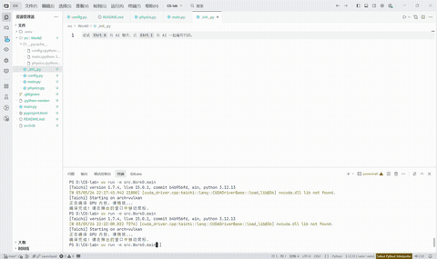

# 实验一 万有引力粒子群仿真
本文将对本次配置的项目架构、代码逻辑及实现功能进行简单介绍
## 目录

- [项目概述](#项目概述)
- [项目架构](#项目架构)
- [代码逻辑](#代码逻辑)
  - [config.py](#configpy)
  - [physics.py](#physicspy)
  - [main.py](#mainpy)
- [实现功能](#实现功能)
- [视频演示](#视频演示)

## 项目概述
本项目为计算机图形学首次实验的环境搭建和万有引力粒子群仿真的完整实现。项目基于 Taichi 语言，利用 GPU 并行计算，模拟大量粒子在牛顿万有引力作用下的运动，粒子之间相互吸引，形成动态的团簇等结构；项目还提供了实时交互窗口，支持鼠标交互改变引力方向。

## 项目架构
项目架构遵循标准的 `src` 布局，模块清晰，结构简单：
```
CG-Lab/
├── .gitignore
├── README.md
├── pyproject.toml
├── uv.lock
└── src/
    └── Work0/
        ├── __init__.py
        ├── config.py      # 仿真参数配置
        ├── main.py         # 主程序、GUI 渲染与交互
        └── physics.py      # 物理计算核心（Taichi kernels）
```

## 代码逻辑
### `config.py`
集中管理所有可调参数，便于调试与实验：
- `NUM_PARTICLES`：粒子总数，根据运行情况调整。
- `GRAVITY_STRENGTH`：鼠标引力强度，影响粒子运动。
- `DRAG_COEF`：空气阻力系数，影响粒子运动。
- `BOUNCE_COEF`：边界反弹能量损耗系数，影响粒子运动。

### `physics.py`
定义粒子数据结构（位置、速度、质量）并实现 GPU 并行计算：
- 初始化每一个粒子的随机坐标。
- 物理更新：由 GPU 并行执行。
  - 计算方向与距离
  - 施加引力与阻力
  - 边框碰撞检测
- 边界处理：粒子被限制在窗口内，并可通过反弹能量损耗系数影响运动方向。

### `main.py`
程序入口，整合物理系统与可视化：
- 初始化，接管底层GPU。
- 导入`config`、`physics`模块。
- 渲染主循环
  - 驱动 GPU 进行物理计算
  - 读取显存数据并绘制粒子

## 实现功能
- **GPU 并行加速**：所有粒子间的力计算都在 GPU 上并行执行，支持大量粒子实时模拟。
- **真实物理模拟**：遵循牛顿万有引力定律，粒子总数可根据运行情况调整，空气阻力系数、边界反弹能量损耗系数、鼠标引力强度可调。
- **交互操作**：鼠标拖动，改变引力方向，粒子随之运动、反弹、碰撞。
- **模块化设计**：配置与物理核心分离，便于修改参数。

## 视频演示
