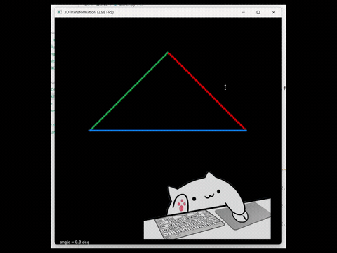
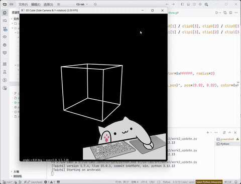

# 实验二 旋转与变换
本文将对本次实验的代码逻辑、实现功能以及优化升级进行简单介绍。

## 目录

- [项目概述](#项目概述)
- [代码逻辑](#代码逻辑)
  - [`get_model_matrix(angle)`](#get_model_matrixangle)
  - [`get_view_matrix(eye_pos)`](#get_view_matrixeye_pos)
  - [`get_projection_matrix(eye_fov-aspect_ratio-znear-zfar)`](#get_projection_matrixeye_fov-aspect_ratio-znear-zfar)
  - [主循环与绘制流程](#主循环与绘制流程)
- [实现功能](#实现功能)
- [视频演示](#视频演示)
- [实验结果说明](#实验结果说明)
- [优化升级（立方体旋转）](#优化升级立方体旋转)

## 项目概述

本项目为计算机图形学中的基础变换实验，基于 **Taichi** 实现一个三维空间中的三角形，通过 **MVP（Model-View-Projection）矩阵** 将其从三维坐标变换到二维屏幕坐标，并在 GUI 窗口中绘制出对应的彩色线框三角形，可以通过键盘交互控制三角形的旋转。

项目中的三角形初始顶点坐标为：

- `v0 = (2.0, 0.0, -2.0)`
- `v1 = (0.0, 2.0, -2.0)`
- `v2 = (-2.0, 0.0, -2.0)`

程序通过以下三个核心变换完成渲染过程：

1. **模型变换（Model）**：控制物体绕 `Z` 轴旋转。
2. **视图变换（View）**：将相机平移到原点。
3. **投影变换（Projection）**：将三维视锥体映射到二维平面。

最终，程序会在 `700 × 700` 的窗口中显示一个线框三角形，并支持键盘交互：

- 按 `A` 键：逆时针旋转三角形
- 按 `D` 键：顺时针旋转三角形
- 按 `Esc` 键：退出程序

---

## 代码逻辑

本实验代码采用单文件结构实现，核心逻辑可分为矩阵构造、顶点变换和图形绘制三部分。

### `get_model_matrix(angle)`

该函数用于构造 **模型变换矩阵**，实现三角形绕 `Z` 轴旋转。

- 输入参数：
  - `angle`：旋转角度，单位为角度制
- 处理过程：
  - 将角度转换为弧度
  - 根据二维平面旋转公式生成绕 `Z` 轴的 `4 × 4` 齐次旋转矩阵
- 输出：
  - `model` 模型矩阵

作用：
- 保持三角形位置不变
- 仅改变其朝向
- 实现动画旋转效果

---

### `get_view_matrix(eye_pos)`

该函数用于构造 **视图变换矩阵**，其本质是将整个场景沿相机位置的反方向平移，使相机位于世界坐标系原点。

- 输入参数：
  - `eye_pos`：相机位置 `(x, y, z)`
- 处理过程：
  - 提取相机坐标 `ex, ey, ez`
  - 构造平移矩阵，将所有物体平移 `(-ex, -ey, -ez)`
- 输出：
  - `view` 视图矩阵

本程序中相机位置设置为：

```python
eye_pos = (0.0, 0.0, 5.0)
```

这表示相机位于 `z=5` 处，朝向 `-Z` 方向观察场景。

---

### `get_projection_matrix(eye_fov, aspect_ratio, zNear, zFar)`

该函数用于构造 **透视投影矩阵**，将三维空间中的点投影到二维平面。

- 输入参数：
  - `eye_fov`：垂直方向视场角
  - `aspect_ratio`：窗口宽高比
  - `zNear`：近裁剪面距离
  - `zFar`：远裁剪面距离

#### 1. 参数预处理

首先将视场角从角度制转换为弧度制：

```python
fov_rad = eye_fov * math.pi / 180.0
```

由于相机朝向 `-Z` 方向，因此：

```python
n = -zNear
f = -zFar
```

接着计算视锥体近裁剪面边界。

#### 2. 透视到正交变换

先构造透视挤压矩阵 `persp`，将视锥体压缩成一个正交长方体；

#### 3. 正交投影变换

然后构造正交投影矩阵，分为两步：

- 平移到中心
- 缩放到标准立方体 `[-1,1]^3`

最终有：

```python
ortho = ortho_scale @ ortho_trans
proj = ortho @ persp
```

作用：
- 将视锥体映射到标准裁剪空间
- 为后续透视除法和屏幕映射提供基础

---

### 主循环与绘制流程

主循环负责完成交互、变换、投影和绘制。

#### 1. 键盘事件处理

程序通过 `gui.get_events()` 检测键盘输入：

- `A`：角度增加 `10°`，实现逆时针旋转
- `D`：角度减少 `10°`，实现顺时针旋转
- `Esc`：退出程序

但因为没有去抖，事件会被重复触发，所以代码中实际设置变化度数为5°

```python
if e.key == 'a' or e.key == 'A':
    angle += 5.0
if e.key == 'd' or e.key == 'D':
    angle -= 5.0
```

#### 2. 计算 MVP 矩阵

根据列向量右乘规则，最终变换顺序为：

```python
MVP = proj @ view @ model
```

即：

1. 先做模型变换
2. 再做视图变换
3. 最后做投影变换

#### 3. 顶点变换流程

每个顶点依次经历以下步骤：

- 扩展为齐次坐标 `(x, y, z, 1)`
- 与 `MVP` 相乘得到裁剪空间坐标 `v_clip`
- 进行透视除法得到 NDC 坐标 `v_ndc`

代码如下：

```python
v_h = ti.Vector([x, y, z, 1.0], dt=ti.f32)
v_clip = MVP @ v_h
v_ndc = ti.Vector([v_clip[0] / v_clip[3],
                   v_clip[1] / v_clip[3],
                   v_clip[2] / v_clip[3]], dt=ti.f32)
```

#### 4. NDC 到屏幕坐标映射

将 NDC 范围 `[-1, 1]` 映射到 GUI 使用的归一化坐标 `[0, 1]`：

```python
u = (v_ndc[0] + 1.0) * 0.5
vcoord = (v_ndc[1] + 1.0) * 0.5
```

这里使用的是 **GUI 的 y 轴向上** 形式，因此三角形将以“正三角”显示。

#### 5. 绘制线框三角形

使用 `gui.line()` 绘制三条边，并设置不同颜色和线宽：

```python
gui.line(begin=ndc_coords[0], end=ndc_coords[1], color=0xff0000, radius=3)
gui.line(begin=ndc_coords[1], end=ndc_coords[2], color=0x009b48, radius=3)
gui.line(begin=ndc_coords[2], end=ndc_coords[0], color=0x0082ff, radius=3)
```

其中：

- 红色：边 `v0 -> v1`
- 绿色：边 `v1 -> v2`
- 蓝色：边 `v2 -> v0`

同时在左下角实时显示当前旋转角度：

```python
gui.text(f"angle = {angle:.1f} deg", pos=(0.02, 0.02), color=0xFFFFFF)
```

---

## 实现功能

本项目实现了以下功能：

- **三维顶点定义**  
  在三维空间中定义三角形三个顶点，并作为场景中的基本几何图元。

- **模型变换**  
  支持三角形绕 `Z` 轴旋转，实现动态姿态变化。

- **视图变换**  
  通过构造视图矩阵，将相机平移到原点，完成观察坐标系转换。

- **透视投影**  
  根据视场角、宽高比、近远裁剪面构造透视投影矩阵，实现三维到二维的投影映射。

- **齐次坐标变换**  
  使用 `4 × 4` 齐次矩阵统一处理旋转、平移和投影操作。

- **透视除法**  
  在裁剪空间坐标基础上完成透视除法，得到标准设备坐标（NDC）。

- **二维线框绘制**  
  将变换后的顶点映射到 GUI 窗口中，并绘制彩色线框三角形。

- **交互式旋转控制**  
  支持键盘按键控制旋转方向和旋转角度。

- **线宽调整**  
  通过 `radius=3` 调整边的粗细，使线框显示更加清晰。

- **实时角度显示**  
  在窗口中实时展示当前旋转角度，便于观察交互效果。

---

## 视频演示


---

## 实验结果说明

程序运行后会弹出一个 `700 × 700` 的黑色背景窗口，窗口中央显示一个由三条彩色边构成的线框三角形。

实验结果特点如下：

- 初始状态下三角形为 **正三角朝上** 的视觉效果
- 每次按下 `A` 或 `D` 键，三角形绕 `Z` 轴旋转 `10°`
- 三条边具有不同颜色，便于辨认旋转方向和顶点连接关系
- 线框宽度可通过 `radius` 参数调整
- 左下角实时显示当前角度值

通过本实验，可以清晰理解图形学中从 **模型坐标系 -> 世界坐标系 -> 观察坐标系 -> 裁剪坐标系 -> NDC -> 屏幕坐标系** 的完整变换流程，也验证了 MVP 矩阵在三维图形渲染中的核心作用。

---

## 优化升级（立方体旋转）

### 目的
通过将原本的二维三角形升级为三维立方体并调整相机视角与模型旋转轴，展现视图变换的三维空间感，便于观察 MVP（Model-View-Projection）在三维场景中的作用。具体目标包括：
- 用线框立方体替代二维三角形，展示三维几何；
- 让立方体绕竖直轴（Y 轴）旋转，符合常见观察直觉；
- 将相机移到侧面并朝向原点（LookAt），从斜侧面观察以增强立体感；
- 保持交互体验（按键旋转），并修复按键重复触发的问题。

---

### 实现改动
- 几何体
  - 用 8 个顶点定义中心在原点、边长为 2 的立方体（顶点坐标在 [-1,1]）。
  - 用 12 条边（顶点索引对）表示线框，逐边进行变换与绘制。

- 模型变换
  - 将 model 矩阵改为仅绕 Y 轴旋转（rotation_y(angle)），实现竖直轴旋转效果。

- 视图变换
  - 使用 LookAt 风格的视图矩阵，使相机位于侧面（如 eye_pos=(3.0, 1.5, 5.0)），朝向原点（center=(0,0,0)），up=(0,1,0)。

- 投影与绘制
  - 沿用透视投影矩阵（根据 fov、aspect、zNear、zFar）。
  - 对每条边的两个端点，依次做 MVP 变换、透视除法、NDC -> 屏幕坐标映射，然后用 gui.line 绘制线段。

- 交互与事件
  - 只在事件类型为 PRESS 时响应按键（e.type == ti.GUI.PRESS），避免一次物理按键被误触发多次。
  - 保留按键控制：A 增角（逆时针），D 减角（顺时针），Esc 退出。（相对于y正半轴）

---

### 关键代码片段

- 事件去抖（只处理 PRESS）
```python
for e in gui.get_events():
    if e.key == ti.GUI.ESCAPE:
        gui.running = False
    if e.type == ti.GUI.PRESS:
        if e.key in ('a','A'):
            angle += angle_step
        elif e.key in ('d','D'):
            angle -= angle_step
```

---

### 视频演示

