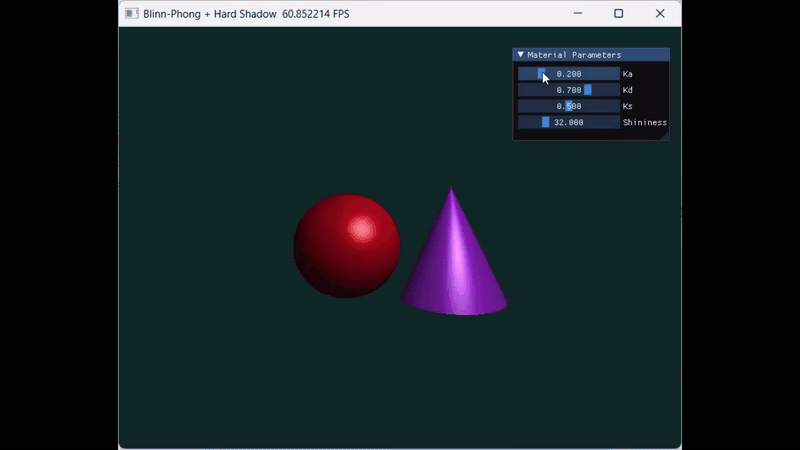

# 实验四：Phong 光照模型

## 目录
1. [项目概述](#项目概述)
2. [实验目标](#实验目标)
3. [实验原理](#实验原理)
4. [代码逻辑](#代码逻辑)
5. [实现功能](#实现功能)
6. [视频演示](#视频演示)
7. [实验结果说明](#实验结果说明)
8. [注意事项与问题分析](#注意事项与问题分析)
9. [优化](#优化)

---

## 项目概述

本实验基于 **Taichi** 实现了一个简单的交互式三维渲染场景，场景中包含一个红色球体和一个紫色圆锥，并使用 **Phong 光照模型**对物体进行着色。  
程序通过对屏幕上的每个像素发射一条射线，计算其与球体和圆锥的交点，并在最近交点处完成环境光、漫反射和镜面高光三部分的叠加，最终得到渲染结果。

实验支持通过 UI 面板实时调节材质参数 `Ka`、`Kd`、`Ks` 和 `Shininess`，从而直观观察不同参数对最终图像效果的影响。

---

## 实验目标

### 1. 理论理解
理解并掌握局部光照的基本原理，区分：
- 环境光（Ambient）
- 漫反射（Diffuse）
- 镜面高光（Specular）

### 2. 数学基础
熟练掌握三维空间中的向量运算，包括：
- 法向量计算
- 光线方向计算
- 视线方向计算
- 反射向量计算

### 3. 工程实践
掌握如何使用 Taichi 实现交互式渲染，结合 UI 控件实时调节材质参数，直观感受各参数对渲染结果的影响。

---

## 实验原理

Phong 光照模型是一种经典的计算机图形学经验模型，它将物体表面反射的光分为三个独立分量，并将它们叠加得到像素颜色：

$$
I = I_{ambient} + I_{diffuse} + I_{specular}
$$

### 1. 环境光（Ambient）
环境光用于模拟场景中经过多次反射后均匀分布的背景光：

$$
I_{ambient} = K_a \times C_{light} \times C_{object}
$$

其中：
- $K_a$：环境光系数
- $C_{light}$：光源颜色
- $C_{object}$：物体基础颜色

### 2. 漫反射（Diffuse）
漫反射用于模拟粗糙表面向各个方向均匀散射的光，其强度与光线入射角余弦成正比：

$$
I_{diffuse} = K_d \times \max(0, \mathbf{N} \cdot \mathbf{L}) \times C_{light} \times C_{object}
$$

其中：
- $\mathbf{N}$：表面法向量
- $\mathbf{L}$：指向光源的单位向量
- $K_d$：漫反射系数

### 3. 镜面高光（Specular）
镜面高光用于模拟光滑表面上的高亮反射，强度与观察方向和理想反射方向夹角有关：

$$
I_{specular} = K_s \times \max(0, \mathbf{R} \cdot \mathbf{V})^n \times C_{light}
$$

其中：
- $\mathbf{R}$：理想反射向量
- $\mathbf{V}$：指向摄像机的单位向量
- $K_s$：镜面高光系数
- $n$：高光指数（Shininess）

最终颜色为三项之和，并在写入像素前限制在合法范围内：

$$
C = clamp(I_{ambient} + I_{diffuse} + I_{specular}, 0, 1)
$$

---

## 代码逻辑

本实验代码整体可分为以下几个部分：

### 1. 初始化与全局变量设置
程序首先初始化 Taichi 运行环境，并定义分辨率、像素缓冲区以及材质参数字段：

- `Ka`：环境光系数
- `Kd`：漫反射系数
- `Ks`：镜面高光系数
- `shininess`：高光指数

同时定义了摄像机位置、光源位置、背景颜色以及两个几何体的基础参数。

---

### 2. 向量与辅助函数
代码中定义了若干辅助函数：

#### `normalize(v)`
用于向量归一化，保证参与点乘运算的向量长度为 1，避免光照计算异常。

#### `reflect(I, N)`
用于计算反射向量：

$$
R = I - 2(I \cdot N)N
$$

#### `clamp_color(c)`
用于将最终颜色限制在 `[0, 1]` 范围内，防止颜色过曝。

---

### 3. 球体求交函数
`intersect_sphere(ro, rd, center, radius)` 使用光线与球体的解析几何方程求交。

球体方程为：

$$
(\mathbf{P} - \mathbf{C}) \cdot (\mathbf{P} - \mathbf{C}) = r^2
$$

其中：
- $\mathbf{P}$ 为交点
- $\mathbf{C}$ 为球心
- $r$ 为半径

将光线参数方程代入后，转化为二次方程，求得交点距离 `t`。  
若存在两个解，则取较小且为正的解作为最近交点。

---

### 4. 圆锥求交函数
`intersect_cone(ro, rd, apex, base_y, radius)` 用于计算光线与竖直圆锥的相交。

该圆锥以顶点 `apex` 为参考点，底面位于 `base_y`，并通过局部坐标系构建锥面方程。  
程序将光线转换到以顶点为原点的局部空间中，利用二次方程求解侧面交点，并进一步判断交点是否落在圆锥高度范围内。

此外，程序还额外计算了底面圆盘的交点，从而完整描述一个**有限圆锥体**，而不仅仅是无限延伸的锥面。

---

### 5. 深度测试与最近交点选择
在渲染过程中，每个像素都会发出一条射线，并分别与球体和圆锥进行求交。

程序维护一个当前最小交点距离 `closest_t`：
- 如果球体交点更近，则记录球体信息
- 如果圆锥交点更近，则覆盖前者

这种机制等价于简化版的 **Z-buffer 深度测试**，能够保证最终显示的是离摄像机最近的物体表面，避免遮挡错误。

---

### 6. Phong 着色计算
当光线命中物体后，程序会计算：

- 光源方向向量 `L`
- 视线方向向量 `V`
- 反射向量 `R`

然后分别计算：
- 环境光项 `ambient`
- 漫反射项 `diffuse`
- 镜面高光项 `specular`

最后将三者相加，得到该像素的最终颜色。

---

### 7. UI 交互面板
程序使用 `ti.ui.Window` 创建交互窗口，并通过 `gui.begin(...)` 构建滑动条面板，允许用户实时调整：

- `Ka`
- `Kd`
- `Ks`
- `Shininess`

参数变化会直接影响渲染结果，从而方便观察不同光照分量的视觉效果。

---

## 实现功能

### 1. 构建代码驱动的三维场景
本实验未使用任何外部模型文件，而是直接在 Taichi Kernel 中通过数学方式构建了两个几何体：

- **红色球体**
  - 圆心：`(-1.2, -0.2, 0)`
  - 半径：`1.2`
  - 颜色：`(0.8, 0.1, 0.1)`

- **紫色圆锥**
  - 顶点：`(1.2, 1.2, 0)`
  - 底面高度：`y = -1.4`
  - 底面半径：`1.2`
  - 颜色：`(0.6, 0.2, 0.8)`

同时设置：
- 摄像机位置：`(0, 0, 5)`
- 点光源位置：`(2, 3, 4)`
- 光源颜色：纯白 `(1.0, 1.0, 1.0)`
- 背景颜色：深青色

---

### 2. 实现光线求交与深度测试
程序对屏幕上每个像素发射一条光线：
1. 计算光线与球体的交点距离 `t`
2. 计算光线与圆锥的交点距离 `t`
3. 取最小的正值 `t` 作为最终可见交点

这样可以正确处理物体之间的遮挡关系，保证渲染结果符合三维空间的深度关系。

---

### 3. 完成 Phong 着色器
程序根据交点处的法向量、光照方向和视线方向计算局部光照效果，实现了：
- 环境光
- 漫反射
- 镜面高光

最终颜色为三项叠加后的结果，并进行颜色裁剪，保证显示正常。

---

### 4. 完成交互式参数调节
通过 UI 面板，用户可以实时调整：
- `Ka`：环境光强度
- `Kd`：漫反射强度
- `Ks`：镜面反射强度
- `Shininess`：高光集中程度

不同参数组合会直接影响材质的明暗变化、表面光泽感以及高光范围。

---

## 视频演示


---

## 实验结果说明

### 1. 场景渲染结果
运行程序后，窗口中可看到：
- 左侧显示一个红色球体
- 右侧显示一个紫色圆锥
- 背景为深青色

两个物体具有明显的明暗变化和高光效果，能够体现 Phong 光照模型的基本特征。

---

### 2. 参数调节效果
通过滑动条调节参数，可观察到以下现象：

#### 调整 `Ka`
- `Ka` 增大时，物体整体更亮
- `Ka` 减小时，阴影区域更暗

#### 调整 `Kd`
- `Kd` 增大时，物体受光区域更明显
- `Kd` 减小时，表面漫反射效果减弱

#### 调整 `Ks`
- `Ks` 增大时，高光更强烈
- `Ks` 减小时，表面更偏哑光

#### 调整 `Shininess`
- 值越大，高光越集中、越尖锐
- 值越小，高光范围更大、更柔和

---

### 3. 结果分析
实验结果表明：
- Phong 模型能够较好地模拟局部光照效果
- 深度测试逻辑正确，两个物体之间不会出现错误遮挡
- UI 参数控制能够实时改变材质表现，交互性良好

---

## 注意事项与问题分析

### 1. 全黑或乱码
若出现全黑或异常图像，通常是因为向量未正确归一化。  
在光照计算前，`N`、`L`、`V` 必须为单位向量。

### 2. 黑色噪点或马赛克
若 `N · L` 为负数，说明光照位于物体背面。  
应使用：

```python
ti.max(0.0, dot_product)
```

来截断负值，避免非法高光计算。

### 3. 颜色过曝发白
最终颜色可能超过 1.0，因此写入像素前必须进行裁剪：

```python
ti.math.clamp(color, 0.0, 1.0)
```

### 4. Taichi 语法兼容性
在 Taichi 1.7.4 中，`@ti.func` 内部不支持在普通 `if` 中直接 `return`。  
因此需要使用“先赋值、后统一 return”的写法，以保证程序正常运行。

---

## 优化
### Blinn-Phong + 硬阴影 扩展实验

### 1. 原理说明

在原有 Phong 局部光照模型的基础上，本实验进一步引入了 **Blinn-Phong 模型** 与 **硬阴影（Hard Shadow）** 机制，以提升渲染结果的真实感与层次感。

#### 1.1 Blinn-Phong 模型

Phong 模型中的镜面高光项通过计算反射向量 $\mathbf{R}$ 与视线方向 $\mathbf{V}$ 的夹角来实现：

$$
I_{specular} = K_s \cdot \max(0, \mathbf{R} \cdot \mathbf{V})^n \cdot C_{light}
$$

而 Blinn-Phong 模型则不再显式计算反射向量，而是引入 **半程向量**（Half Vector）$\mathbf{H}$：

$$
\mathbf{H} = \frac{\mathbf{L} + \mathbf{V}}{\|\mathbf{L} + \mathbf{V}\|}
$$

其中：
- $\mathbf{L}$ 表示指向光源的单位向量
- $\mathbf{V}$ 表示指向观察者/摄像机的单位向量

Blinn-Phong 的镜面项写为：

$$
I_{specular} = K_s \cdot \max(0, \mathbf{N} \cdot \mathbf{H})^n \cdot C_{light}
$$

其中 $\mathbf{N}$ 为表面法向量，$n$ 为高光指数（Shininess）。

该方法本质上用“法线与半程方向夹角”近似“视线与理想反射方向夹角”，计算更稳定，也更适合实时渲染。

---

#### 1.2 硬阴影（Hard Shadow）

硬阴影的核心思想是：  
在交点处向光源方向发射一条 **阴影射线（Shadow Ray）**。如果这条射线在到达光源之前与场景中的其他物体相交，则说明该点被遮挡，处于阴影中。

若点处于阴影中，则仅保留环境光分量：

$$
I = I_{ambient}
$$

若未被遮挡，则继续计算漫反射与镜面高光：

$$
I = I_{ambient} + I_{diffuse} + I_{specular}
$$

---

### 2. 与 Phong 的区别

#### 2.1 镜面高光计算方式不同
- **Phong 模型**：基于反射向量 $\mathbf{R}$ 与视线向量 $\mathbf{V}$ 的点积
- **Blinn-Phong 模型**：基于法向量 $\mathbf{N}$ 与半程向量 $\mathbf{H}$ 的点积

#### 2.2 视觉表现差异
在高光区域边缘，尤其是光照入射角较大时：

- **Phong 模型** 的高光会更依赖精确的反射方向，区域通常较窄，边缘收缩更明显；
- **Blinn-Phong 模型** 的高光通常更平滑、更稳定，在大入射角情况下不容易出现高光突然消失的现象。

因此，Blinn-Phong 在实时渲染中常被认为更“自然”，尤其适合交互式场景。

#### 2.3 计算代价与稳定性
- Phong 需要显式计算反射向量；
- Blinn-Phong 只需计算半程向量，数值上更简洁，通常也更稳定。

---

### 3. 阴影实现方法

本实验采用 **硬阴影检测**，具体步骤如下：

1. 首先在主光照着色点 $\mathbf{P}$ 处计算法向量与基础颜色；
2. 令阴影射线起点为：
   $$
   \mathbf{P}' = \mathbf{P} + \epsilon \mathbf{L}
   $$
   其中 $\epsilon$ 是一个很小的偏移量，用于避免自相交；
3. 从 $\mathbf{P}'$ 朝光源方向发射阴影射线；
4. 分别测试该射线是否与球体、圆锥相交；
5. 若在到达光源之前发生相交，则判定该点处于阴影中；
6. 阴影中仅保留环境光，不计算漫反射和镜面高光。

这种方法实现简单，能够清晰地表现物体之间的遮挡关系，形成明显的阴影边界。

---

### 4. 实验现象分析



#### 4.1 Blinn-Phong 高光效果
在启用 Blinn-Phong 后，物体表面的高光区域更加平滑自然，尤其在：
- 视角变化时
- 光线与表面法线夹角较大时

高光不会像传统 Phong 那样过于尖锐或突然消失，而是表现出更连续的过渡。

#### 4.2 阴影效果
加入硬阴影后，场景中可观察到：
- 被遮挡区域明显变暗
- 阴影边缘清晰，没有模糊过渡
- 物体之间的空间层次感更强

例如，当球体或圆锥阻挡光源时，其背光面或后方区域会只显示环境光，形成直观的黑影区域。

#### 4.3 交互调节效果
通过调整材质参数：
- 增大 `Ks`：高光更明显
- 增大 `Shininess`：高光区域更集中
- 增大 `Ka`：阴影区域整体变亮
- 增大 `Kd`：受光面漫反射更强

这使得用户可以直观观察 Blinn-Phong 与硬阴影对最终图像的影响。

---

### 5. 小结

通过将 Phong 模型升级为 Blinn-Phong，并加入硬阴影检测，本实验在保持代码结构简洁的前提下，进一步提升了渲染结果的视觉表现力。  
Blinn-Phong 改善了高光区域的稳定性与连续性，而硬阴影则增强了场景的空间遮挡关系，使最终图像更接近真实光照效果。
