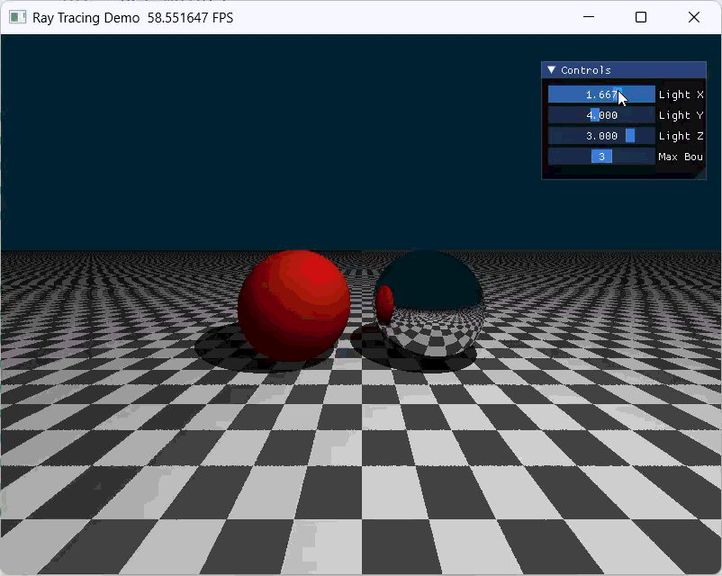

# 实验五：光线追踪

## 目录
1. [项目概述](#项目概述)  
2. [实验目标](#实验目标)  
3. [实验原理](#实验原理)  
4. [代码逻辑](#代码逻辑)  
5. [实现功能](#实现功能)  
6. [视频演示](#视频演示)
7. [实验结果说明](#实验结果说明) 
8. [优化](#优化)  

---

## 项目概述

本实验基于 Taichi 1.7.4 实现一个简化的 **Whitted-Style Ray Tracing**（惠特式光线追踪）渲染器。  
场景中包含：

- 一个无限大棋盘地面
- 一个红色漫反射球
- 一个银色镜面球
- 一个可交互的点光源
- 一个可调节最大弹射次数的 UI 面板

实验通过 **主光线 + 次级射线** 的方式模拟硬阴影与理想镜面反射，并采用 **迭代循环** 代替递归，适配 GPU 并行计算模型。

---

## 实验目标

### 1. 理论理解
理解 **光线投射（Ray Casting）** 与 **光线追踪（Ray Tracing）** 的本质区别：

- **Ray Casting**：通常只判断光线是否与场景相交，或做简单可见性测试。
- **Ray Tracing**：会进一步追踪光线与物体交互后的次级光线，如反射、阴影等，从而获得更真实的视觉效果。

### 2. 全局光照
掌握如何通过发射 **次级射线（Secondary Rays）** 实现：

- **硬阴影（Hard Shadows）**
- **理想镜面反射（Perfect Reflection）**

### 3. GPU 编程思维
学习如何将传统递归式光线追踪改写为适合 GPU 的 **迭代循环模式**，避免递归带来的实现和性能问题。

---

## 实验原理

本实验采用经典的 **Whitted-Style 光线追踪模型**。  
当一条主光线（Primary Ray）从摄像机出发并击中物体表面时，会进行以下处理：

### 1. 阴影测试
从交点朝光源方向发射一条 **暗影射线**。  
若该射线在到达光源之前击中了其他物体，则说明该点处于阴影中，只保留环境光。

### 2. 材质分支
- **漫反射材质（Diffuse）**：  
  按照 Phong 光照模型计算颜色，然后终止该条光线的传播。

- **理想镜面材质（Mirror）**：  
  根据反射定律计算新的反射方向，继续追踪反射射线，直到击中漫反射物体或达到最大弹射次数。

### 3. 反射向量公式
反射方向满足：

$$
\mathbf{R} = \mathbf{L}_{in} - 2(\mathbf{L}_{in} \cdot \mathbf{N})\mathbf{N}
$$

其中：

- $\mathbf{L}_{in}$：入射光线方向
- $\mathbf{N}$：表面法向量
- $\mathbf{R}$：反射方向

### 4. 浮点误差处理
为了避免自相交问题，所有次级射线的起点都需要沿法线方向做一个极小偏移：

$$
\mathbf{P}_{new} = \mathbf{P} + \mathbf{N}\times \epsilon
$$

其中 $$\epsilon$$ 一般取 `1e-4`。  
否则会出现典型的 **Shadow Acne**，即满屏黑色噪点。

---

## 代码逻辑

下面结合实验代码说明核心逻辑。

---

### 1. 初始化与参数定义

代码首先初始化 Taichi 运行环境，并定义图像分辨率、光源位置、弹射次数等全局变量。

```python
ti.init(arch=ti.gpu)

res_x, res_y = 800, 600
pixels = ti.Vector.field(3, dtype=ti.f32, shape=(res_x, res_y))
```

其中：

- `pixels` 是输出图像缓冲区
- `light_pos_x/y/z` 用于 UI 控制光源位置
- `max_bounces` 用于控制反射次数

---

### 2. 材质系统

为了区分不同物体的光学性质，代码使用材质 ID：

```python
MAT_DIFFUSE = 0
MAT_MIRROR = 1
```

在求交函数中，不同物体返回不同的 `mat_id`，从而决定后续的着色方式。

---

### 3. 几何体求交

#### 球体求交
球体通过解析几何方法求交。  
根据光线参数方程与球方程联立后，解二次方程得到交点。

```python
@ti.func
def intersect_sphere(ro, rd, center, radius):
```

返回：

- `t`：交点距离
- `normal`：交点法线

---

#### 平面求交
地面用无限平面表示，平面方程为：

```python
y = -1.0
```

代码通过求解光线与平面的参数 `t` 得到交点。

---

### 4. 场景求交函数

```python
@ti.func
def scene_intersect(ro, rd):
```

该函数负责遍历整个场景，找到最近交点，并返回：

- `min_t`
- `hit_n`
- `hit_c`
- `hit_mat`

场景中包含三个物体：

1. **红色漫反射球**
2. **银色镜面球**
3. **黑白棋盘地面**

棋盘格通过交点坐标的奇偶性实现：

```python
ix = ti.floor(p.x * grid_scale)
iz = ti.floor(p.z * grid_scale)

if (ix + iz) % 2 == 0:
    hit_c = ti.Vector([0.3, 0.3, 0.3])
else:
    hit_c = ti.Vector([0.8, 0.8, 0.8])
```

---

### 5. 迭代式光线弹射

主渲染逻辑位于 `render()` 中。  
每个像素都会生成一条主光线，然后通过 `for bounce in range(max_bounces[None])` 实现多次弹射。

```python
final_color = ti.Vector([0.0, 0.0, 0.0])
throughput = ti.Vector([1.0, 1.0, 1.0])
```

- `final_color`：累积最终颜色
- `throughput`：表示光线能量衰减

#### 镜面反射
当光线击中镜面球时：

```python
ro = p + N * EPS
rd = normalize(reflect(rd, N))
throughput *= 0.8 * obj_color
```

含义：

- 通过法线偏移避免自相交
- 更新射线方向为反射方向
- 将能量乘以反射率衰减

#### 漫反射着色
当光线击中漫反射物体时：

```python
final_color += throughput * direct_light
break
```

即：

- 计算当前交点的局部光照
- 累加到最终颜色
- 终止该条路径

---

### 6. 硬阴影计算

在漫反射着色中，会从交点发射一条暗影射线：

```python
shadow_ray_orig = p + N * 1e-4
shadow_t, _, _, _ = scene_intersect(shadow_ray_orig, L)
```

若障碍物位于光源前方，则该点处于阴影中，只保留环境光分量。

---

### 7. UI 交互面板

实验使用 `ti.ui.Window` 和 `gui` 创建控制面板：

- Light X
- Light Y
- Light Z
- Max Bounces

用户可以实时拖动滑动条，观察：

- 光照位置变化
- 阴影移动
- 反射层数变化
- “镜中世界”效果是否出现

---

## 实现功能

本实验成功实现了以下功能：

### 1. 三维场景搭建
- 无限大棋盘地面
- 左侧红色漫反射球
- 右侧银色镜面球

### 2. 光线追踪渲染
- 从摄像机发射主光线
- 计算与场景几何体的交点
- 根据材质类型决定后续行为

### 3. 硬阴影
- 通过暗影射线判断光照可见性
- 被遮挡区域仅显示环境光

### 4. 理想镜面反射
- 根据反射定律生成新的反射射线
- 支持多次弹射
- 模拟镜面反射的“镜中世界”效果

### 5. 迭代式实现
- 使用 `for` 循环代替递归
- 更适合 GPU 并行执行
- 便于控制最大弹射次数

### 6. UI 动态交互
- 可实时调节点光源位置
- 可调节最大反射次数
- 动态观察阴影与反射变化

---

## 视频演示


___

## 实验结果说明

### 1. 场景显示效果
运行程序后，可以观察到：

- 下方为黑白棋盘地面
- 左侧为红色漫反射球
- 右侧为银色镜面球
- 光源移动会实时改变阴影位置

### 2. 阴影效果
当光源被球体或其他物体遮挡时，地面和球体表面会出现明显的硬阴影。  
阴影边界清晰，没有柔化过渡，符合点光源下的 **Hard Shadow** 特征。

### 3. 镜面反射效果
当 `Max Bounces > 1` 时，镜面球能够反射周围场景，出现明显的“镜中世界”视觉效果。  
当 `Max Bounces = 1` 时，则不会继续追踪反射射线，因此镜面效果会明显减弱。

### 4. UI 交互效果
通过滑动条调整光源位置：

- 光源上移：阴影会缩短
- 光源侧移：阴影会横向移动
- 光源下移：阴影会拉长

修改 `Max Bounces`：

- `1`：仅主光线命中结果
- `2~5`：可见多次反射的递归效果

### 5. 典型问题与修复
实验过程中曾遇到：

- `@ti.func` 中动态分支直接 `return`
- 光线自相交导致的 Shadow Acne
- 图像上下翻转问题

这些问题通过：

- 将返回值改为局部变量统一返回
- 在次级射线起点加入法线偏移
- 统一屏幕坐标映射方式

得以解决。

---

## 优化

### 玻璃材质与抗锯齿

---

### 1. 折射与玻璃材质（+15%）

#### 原理说明

为了使场景中的红球更符合真实玻璃材质的视觉效果，本实验引入了 **折射（Refraction）** 与 **全反射（Total Internal Reflection, TIR）** 机制。  
当光线从一种介质进入另一种介质时，其传播方向会按照 **斯涅尔定律（Snell's Law）** 发生偏折：

$$
n_1 \sin \theta_1 = n_2 \sin \theta_2
$$

其中：

- $n_1$、$n_2$ 分别为入射介质与透射介质的折射率；
- $\theta_1$、$\theta_2$ 分别为入射角与折射角。

在本实验中，将原本的红色漫反射球替换为 **玻璃材质球**。  
当光线射入玻璃球时，会同时产生：

- **反射光线**：遵循反射定律；
- **折射光线**：根据斯涅尔定律计算透射方向。

此外，当光线从高折射率介质射向低折射率介质时，如果入射角大于临界角，则会发生 **全反射**，此时不会产生折射光线，而仅保留反射光线继续追踪。

为了更真实地表现玻璃材质，本实验还结合了 **Fresnel 反射近似** 和轻微的 **Beer-Lambert 吸收**，使玻璃在不同观察角度下呈现出更明显的边缘高光和透光感。

#### 实现方法

在代码实现中，首先为场景增加玻璃材质标识，例如：

```python
MAT_GLASS = 2
```

在光线与球体求交后，如果命中玻璃球，则不再将其视为普通漫反射物体，而是根据入射方向和法线方向计算折射与反射：

1. 判断光线是在玻璃外部还是内部；
2. 根据当前介质与目标介质的折射率计算折射比：
   $$
   \eta = \frac{n_1}{n_2}
   $$
3. 使用 Snell 定律求出折射方向；
4. 判断是否满足全反射条件；
5. 若发生全反射，则只追踪反射光线；
6. 若未发生全反射，则根据 Fresnel 系数在反射与折射之间进行能量分配。

折射方向计算的核心形式为：

```python
refr_dir, tir = refract(rd, outward_n, eta)
```

其中 `tir` 表示是否发生全反射。  
若为真，则只保留反射分量；否则继续追踪折射光线。

为了使玻璃更“像玻璃”，还对透射光进行轻微吸收处理，使穿过玻璃后的颜色略有衰减，从而增强材质层次感。

#### 实验现象分析

加入玻璃材质后，原本的红球将不再表现为普通的漫反射球体，预期呈现出以下特征：

- 球体边缘出现明显的高光和反射效果；
- 从不同视角观察时，球体内部会出现背景和地面的扭曲透视；
- 在某些角度下，球体边缘亮度增强，这是 Fresnel 效应导致的；
- 当光线以较大角度进入玻璃内部时，会出现全反射现象，使球体局部更亮、更有层次感。

实际效果不完全符合，整体上，玻璃球更接近“灰色实体”的视觉表现。

---

### 2. 抗锯齿（Anti-Aliasing, MSAA）（+10%）

#### 原理说明

在传统光线追踪中，每个像素通常只发射一条主光线进行采样。  
这种做法虽然实现简单，但当物体边缘与像素网格不完全对齐时，会出现明显的 **锯齿现象**，尤其在球体轮廓、棋盘格边界和斜线区域最为明显。

为降低这种离散采样带来的误差，本实验采用 **多重采样抗锯齿（MSAA）** 思路：  
在每个像素内部随机采样多个子像素位置，并向这些位置分别发射主光线，最后将所有采样颜色取平均作为该像素的最终颜色。

其本质是对像素覆盖区域进行近似积分：

$$
C_{pixel} \approx \frac{1}{N} \sum_{i=1}^{N} C_i
$$

其中：

- $N$ 为每像素采样数；
- $C_i$ 为第 $i$ 次采样得到的颜色。

通过这种方式，可以显著减弱边缘区域因单点采样带来的跳变，从而获得更平滑的图像效果。

#### 实现方法

在渲染阶段，不再只为每个像素生成一条固定主光线，而是在一个像素内部重复采样多次。  
每次采样时，对像素坐标加入随机扰动：

```python
rx = ti.random(ti.f32)
ry = ti.random(ti.f32)
```

然后将带有抖动的子像素坐标映射为屏幕空间方向，计算对应光线的颜色。  
最后将所有采样结果累加并平均：

```python
accum += trace_ray(cam_pos, rd, light_p)
pixels[i, j] = accum / spp[None]
```

其中 `spp` 表示每像素采样次数（samples per pixel）。  
采样次数越高，边缘越平滑，但计算开销也越大。因此在实际运行中需要在渲染质量与性能之间做平衡。

#### 实验现象分析

加入抗锯齿后，图像质量有明显提升，主要体现在以下几个方面：

- 球体轮廓边缘由“阶梯状”变得更加平滑；
- 棋盘格地面边界处的锯齿感减弱；
- 斜线和曲线区域的像素跳变更加柔和；
- 整体画面视觉上更自然，减少了明显的离散采样痕迹。

当采样数较低时，锯齿虽然有所减轻，但仍可能保留少量噪点；  
当采样数提高后，图像更加平滑，但渲染速度会下降。因此，MSAA 实质上是在图像质量和性能之间做出折中。

---

### 视频演示

