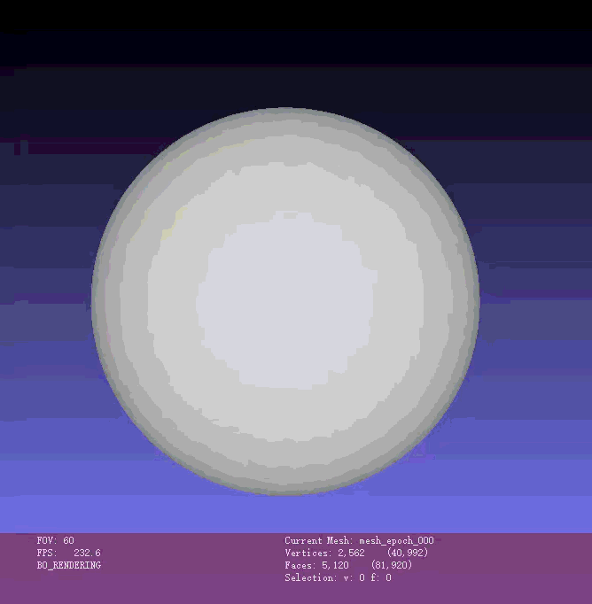

# 可微渲染实验报告  
## —— 从球体到奶牛的多视角剪影优化

---

## 目录
1. [项目概述](#项目概述)  
2. [实验目标](#实验目标)  
3. [实验原理](#实验原理)  
   - [3.1 可微光栅化与软剪影](#31-可微光栅化与软剪影)  
   - [3.2 网格正则化](#32-网格正则化)  
4. [实验任务与步骤](#实验任务与步骤)  
5. [代码逻辑说明](#代码逻辑说明)  
   - [5.1 环境与设备配置](#51-环境与设备配置)  
   - [5.2 目标网格加载与归一化](#52-目标网格加载与归一化)  
   - [5.3 多视角摄像机与目标剪影生成](#53-多视角摄像机与目标剪影生成)  
   - [5.4 源网格初始化与优化变量定义](#54-源网格初始化与优化变量定义)  
   - [5.5 可微优化循环](#55-可微优化循环)  
   - [5.6 可视化与结果保存](#56-可视化与结果保存)  
6. [实现功能](#实现功能)  
7. [视频演示](#视频演示) 
8. [实验结果说明](#实验结果说明)  
9. [总结](#总结)  

---

## 项目概述

本实验基于 **PyTorch3D** 实现了一个典型的三维可微重建任务：  
以一个初始的球体网格作为源模型，通过多视角二维剪影监督和梯度下降优化，使其逐渐拟合为目标奶牛网格的三维形状。

实验的核心思想是：

- 将三维网格通过**可微渲染**投影到二维图像；
- 比较当前渲染结果与目标图像之间的差异；
- 将图像误差反向传播到网格顶点；
- 通过优化顶点偏移量，逐步改变网格形状。

该过程不仅体现了可微光栅化在几何优化中的应用，也展示了网格正则化在防止形状退化、保持表面平滑方面的重要作用。

---

## 实验目标

本实验旨在完成以下三个方面的学习与掌握：

1. **理解并掌握可微光栅化的原理**  
   特别是处理离散几何体 Mesh 边界时，如何通过连续近似获得可导梯度。

2. **掌握多视角二维图像反推三维网格的方法**  
   通过多个摄像机视角下的剪影图，反向优化三维空间中的顶点坐标。

3. **理解正则化在网格优化中的作用**  
   学习拉普拉斯平滑、边长一致性、法线一致性等约束如何防止拓扑崩坏与局部最优。

---

## 实验原理

本实验的目标是将一个初始“球体”通过梯度下降，逐渐“捏”成一头“奶牛”的形状。这个过程需要解决两个关键问题：**梯度消失**与**局部最优**。

### 3.1 可微光栅化与软剪影

在传统渲染中，像素要么位于三角形内部，要么位于外部，这种硬判定会导致边界处的梯度为 0，从而无法有效指导顶点移动。

为了解决这一问题，实验采用 **Soft Rasterization** 思想，将像素是否属于三角形的判定转化为一个平滑的概率函数：

$$
A(d) = \text{sigmoid}\left(\frac{d}{\sigma}\right)
$$

其中：

- $d$：像素到三角形边界的距离；
- $\sigma$：控制边缘平滑程度的超参数。

这种方式使得即使顶点不在当前像素的直接影响范围内，也能获得非零梯度，从而实现稳定优化。

### 3.2 网格正则化

如果只依赖图像误差进行优化，网格可能为了匹配某些视角而产生严重扭曲，形成尖刺、交叉或局部塌陷，最终陷入局部最优。

因此，在总损失中引入三种正则化项：

- **拉普拉斯平滑（Laplacian Smoothing）**  
  约束局部邻域顶点变化，防止表面出现尖锐突起。

- **边长一致性（Edge Length Penalty）**  
  惩罚边长过长或过短，避免三角形过度拉伸或塌缩。

- **法线一致性（Normal Consistency）**  
  约束相邻三角面法线方向接近，使表面保持连续平滑。

最终总损失定义为：

$$
L_{total} = L_{silhouette} + w_{lap}L_{lap} + w_{edge}L_{edge} + w_{normal}L_{normal}
$$

其中各项权重用于平衡图像拟合与几何约束。

---

## 实验任务与步骤

### 3.1 环境配置
由于实验涉及底层 CUDA/C++ 算子，需要安装以下依赖：

- `torch`
- `torchvision`
- `pytorch3d`

### 3.2 加载目标模型并生成参考图
- 载入目标奶牛网格（Target Mesh）；
- 在空间中均匀设置多个摄像机视角；
- 渲染出目标剪影图（Silhouettes）作为优化参考。

### 3.3 初始化源模型与渲染管线
- 初始化一个细分等级较高的球体网格（Source Mesh）；
- 构建基于 PyTorch3D 的软剪影光栅化器（SoftSilhouetteShader）。

### 3.4 执行可微优化循环
- 将球体顶点偏移量 `deform_verts` 设为可微参数；
- 计算当前形变后球体的剪影图；
- 与目标剪影图计算 MSE Loss；
- 加入拉普拉斯、边长、法线正则项；
- 使用 Adam 或 SGD 更新顶点偏移量。

### 3.5 可视化与输出
- 定期展示当前网格与目标轮廓的对比；
- 保存中间过程的 `.obj` 文件；
- 观察球体逐渐变形为奶牛的过程。

---

## 代码逻辑说明

以下结合实验代码，对核心流程进行逐步说明。

### 5.1 环境与设备配置

```python
device = torch.device("cuda:0" if torch.cuda.is_available() else "cpu")
torch.manual_seed(42)
np.random.seed(42)
```
#### 作用
- 自动检测 GPU 是否可用；
- 若有 CUDA 则优先使用 GPU 加速；
- 固定随机种子，保证实验结果可复现。

---

### 5.2 目标网格加载与归一化

```python
verts, faces, _ = load_obj(obj_path)
verts = verts.to(device)
faces_idx = faces.verts_idx.to(device)

verts = verts - verts.mean(0)
scale = verts.abs().max()
verts = verts / scale

target_mesh = Meshes(verts=[verts], faces=[faces_idx])
```

#### 作用
- 从 `cow.obj` 读取目标奶牛模型；
- 将顶点移动到原点附近，并缩放至统一尺度；
- 构造目标网格对象 `target_mesh`。

#### 优点
- 归一化后，优化更稳定；
- 避免因模型尺度过大或偏移过远导致渲染失真。

---

### 5.3 多视角摄像机与目标剪影生成

```python
num_views = 20
elev = torch.zeros(num_views, device=device)
azim = torch.linspace(-180, 180, num_views, device=device)

R, T = look_at_view_transform(dist=2.7, elev=elev, azim=azim)
cameras = FoVPerspectiveCameras(device=device, R=R, T=T)
```

#### 作用
- 在水平方向均匀布置多个摄像机视角；
- 用于从多个角度观察目标奶牛网格；
- 减少单视角投影歧义。

随后通过软剪影渲染得到目标图像：

```python
target_silhouette = shader(
    rasterizer(target_mesh.extend(num_views)),
    target_mesh.extend(num_views)
)[..., 3]
```

#### 作用
- 将目标网格渲染为 20 个视角下的剪影图；
- 取 alpha 通道作为轮廓监督信号。

---

### 5.4 源网格初始化与优化变量定义

```python
src_mesh = ico_sphere(level=4, device=device)
deform_verts = torch.zeros_like(src_mesh.verts_packed(), requires_grad=True)
optimizer = torch.optim.Adam([deform_verts], lr=0.01)
```

#### 作用
- 使用细分等级较高的球体作为初始源网格；
- 将所有顶点位移设为可学习参数；
- 使用 Adam 优化器进行更新。

#### 为什么从球体开始
球体拓扑简单、连续、光滑，作为初始形状更容易通过梯度下降逐渐逼近复杂目标。

---

### 5.5 可微优化循环

每一轮迭代都执行以下流程：

#### 1. 顶点形变
```python
new_src_mesh = src_mesh.offset_verts(deform_verts)
```

将可学习的顶点偏移应用到球体，得到当前形变后的网格。

#### 2. 渲染当前剪影
```python
pred_silhouette = shader(
    rasterizer(new_src_mesh.extend(num_views)),
    new_src_mesh.extend(num_views)
)[..., 3]
```

将当前网格在多个视角下渲染为剪影图。

#### 3. 计算损失
```python
loss_silhouette = torch.mean((pred_silhouette - target_silhouette) ** 2)

loss_lap = mesh_laplacian_smoothing(new_src_mesh)
loss_edge = mesh_edge_loss(new_src_mesh)
loss_normal = mesh_normal_consistency(new_src_mesh)

loss = (
    loss_silhouette
    + w_lap * loss_lap
    + w_edge * loss_edge
    + w_normal * loss_normal
)
```

#### 作用
- `loss_silhouette`：约束当前形状与目标轮廓一致；
- `loss_lap`：抑制局部尖刺和高频噪声；
- `loss_edge`：防止边过长或过短；
- `loss_normal`：维持局部表面平滑。

#### 4. 反向传播与参数更新
```python
loss.backward()
optimizer.step()
```

通过梯度下降更新 `deform_verts`，使网格逐步逼近奶牛形状。

---

### 5.6 可视化与结果保存

```python
if i % 20 == 0 or i == epochs - 1:
    save_obj(save_path, current_verts, current_faces)
```

#### 作用
- 每隔 20 轮保存一次 `.obj` 文件；
- 便于后续观察中间结果；
- 可用于生成动画或进行对比分析。

同时可视化目标剪影与当前预测剪影：

- 左图：Ground Truth Silhouette
- 右图：Optimizing... (Epoch i)

这使得优化过程的收敛情况非常直观。

---

## 实现功能

本实验代码实现了以下功能：

### 1. 目标网格读取与标准化
- 成功读取 `cow.obj`；
- 将模型归一化到统一尺度。

### 2. 多视角目标剪影生成
- 构建 20 个均匀分布的摄像机视角；
- 渲染目标奶牛剪影作为监督信号。

### 3. 球体初始化与可学习形变
- 采用高细分 `ico_sphere` 作为源网格；
- 用 `deform_verts` 控制顶点位置变化。

### 4. 可微渲染优化
- 使用 `SoftSilhouetteShader` 实现边界平滑渲染；
- 通过 MSE 进行轮廓拟合。

### 5. 网格正则化约束
- 集成 Laplacian smoothing；
- 集成 edge length penalty；
- 集成 normal consistency。

### 6. 中间结果保存与实时展示
- 自动输出 `.obj` 文件；
- 图像窗口实时显示优化进展。

---

## 视频演示


---

## 实验结果说明

### 1. 初始阶段
在优化开始时，源模型是一个标准球体，其投影轮廓与奶牛形状差异较大，因此剪影损失较高。

### 2. 中间阶段
随着迭代进行：
- 球体顶部逐渐向“耳朵”区域鼓起；
- 两侧逐渐扩展以接近牛头轮廓；
- 下部逐渐形成身体与腿部结构；
- 正则化项抑制了网格破碎与尖刺现象。

### 3. 后期阶段
在多视角监督作用下，优化结果逐渐呈现出奶牛的整体外形特征：
- 轮廓更加接近目标；
- 表面更平滑；
- 顶点分布更合理；
- 中间保存的 `.obj` 文件可用于进一步分析或可视化。

### 4. 结果特点
- **优点**：  
  多视角剪影约束有效提升了三维重建的稳定性；  
  正则化显著减少了网格退化。

- **局限性**：  
  仅依赖剪影监督时，内部几何细节仍可能存在歧义；  
  若目标形状复杂，仅靠轮廓信息可能无法完全恢复精确三维结构。

---

## 总结

本实验通过 PyTorch3D 构建了一个完整的可微渲染网格优化流程，实现了从初始球体到目标奶牛形状的渐进式重建。

实验加深了对以下内容的理解：

- 可微光栅化如何为离散几何提供可传播梯度；
- 多视角监督如何缓解单视图歧义；
- 正则化如何防止网格在优化过程中拓扑崩坏；
- 如何通过损失函数设计将二维图像约束转化为三维几何优化。

---

## 附：核心损失函数形式

$$
L_{total} = L_{silhouette} + w_{lap}L_{lap} + w_{edge}L_{edge} + w_{normal}L_{normal}
$$

其中：

- $L_{silhouette}$：目标剪影与预测剪影之间的均方误差；
- $L_{lap}$：拉普拉斯平滑损失；
- $L_{edge}$：边长约束损失；
- $L_{normal}$：法线一致性损失。